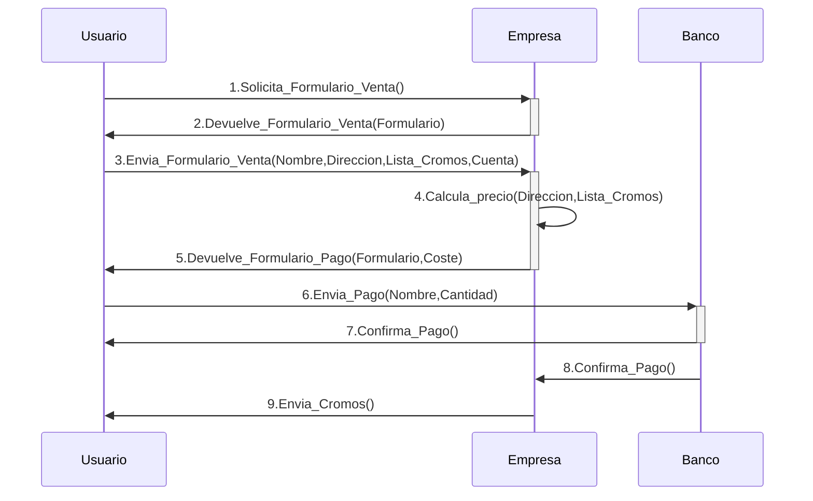

#review2 

- Por ejemplo, supongamos que nos faltan 4 cromos en nuestra colección, y que queremos pedirlo a la empresa que los distribuye. En la página web de esta empresa tienen un formulario que hay que rellenar, con datos como nuestro nombre, dirección y el número de los cromos que necesitamos. Este es el **formato** del formulario que ha creado la empresa con los datos que necesita para poder prestar su servicio. Una vez rellenados estos datos, el usuario envía el formulario y el servidor, como **acción** asociado a este envío, calcula el coste de este servicio (por ejemplo, sumando el coste de cada cromo y sumándole los gastos de envío a la dirección proporcionada) y se lo envía al usuario como otro formulario en donde debe incluir los datos de su tarjeta de crédito (nuevamente vemos otro **formato** diferente de datos que se debe rellenar). Finalmente, el usuario valida la compra desde su aplicación bancaria y la orden entra en el departamento de ventas de la empresa, quienes enviarán un paquete con los cromos comprados por el usuario. 
- La siguiente figura muestra el intercambio de mensajes, su formato y el orden [^1]

[^1]: la figura muestra un intercambio simplificado.