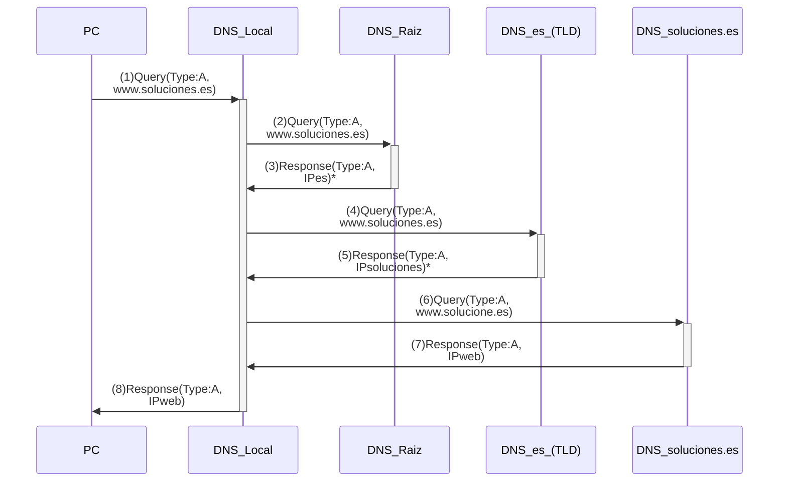

#flashcards/dns 
#review2 

- Ejemplo donde un usuario en un *PC* solicita acceder al equipo www.soluciones.es. El *PC* tiene configurado como servidor DNS a _DNS local_, y por lo tanto conoce su dirección IP. A su vez, el _DNS local_ sólo conoce la dirección IP de un _DNS raíz_, este a un _DNS.es_ que finalmente conoce la IP del DNS autorizado del dominio _soluciones.es_. Asumimos que el _DNS local_ funciona en modo **recursivo** y el resto de servidores en modo **iterativo**.

1. En la figura se puede ver cómo el _PC_ envía al *DNS local* una solicitud donde en la sección _Queries_ se incluye un RR tipo A con nombre www.soluciones.es.
2. El _DNS local_ no tiene la información solicitada, por lo que recorre los diferentes componentes del nombre de izquierda a derecha y lo compara con su propia base de datos (BBDD) de nombre. Como se ha comentado, la única información que tiene en su BBDD es la de un servidor raíz, por lo que envía una solicitud similar a la recibida del *PC*.
3. El _DNS raíz_ recibe la solicitud, pero no tiene la IP asociada al nombre solicitado, por lo que recorre el nombre y lo compara con las entradas en su BBDD, encontrando una correspondencia con el componente *.es*. El _DNS raíz_ responde con un mensaje DNS donde en la sección de *Authoritative Nameservers* incluye un RR de tipo NS con el campo *Name* igual a *.es* y el campo *Name Server* igual al nombre de un servidor DNS que sirve al dominio *.es* (en nuestro caso, *DNS.es*). Además, incluye en la sección _Additional Records_ un registro tipo A con el campo *Name* igual a *DNS.es* y campo *Address* la dirección IP asociado a dicho servidor DNS.
4. El _DNS local_ almacena la información recibida, y contacta con el servidor TLD de *.es* devuelto por el _DNS raíz_, con una solicitud similar a (1) y (2).
5. El servidor *DNS.es* realiza acciones similares a las descritas en el punto (3) y devuelve los registros NS y A asociados al servidor DNS *soluciones.es*.
6. Después de guardar la información recibida, el *DNS local* contacta con el DNS *soluciones.es*
7. El DNS *soluciones.es* es un DNS autorizado para el dominio donde se encuentra el equipo solicitado, por lo que devuelve en la sección *Answers* un RR tipo A con el campo *Name* igual a www.soluciones.es y en el campo *Address* la IP asociada a dicho nombre.
8. Después de almacenar la información recibida, el *DNS local* devuelve la respuesta al PC.

(*) En estos mensajes de respuesta se incluyen otros registros, como registros de tipo NS con los nombres de los servidores DNS devueltos como respuestas a las peticiones[^1]. Además, en los propios mensajes se incluyen registros de tipo A que asocian las direcciones IP a los nombres de los servidores DNS comentados anteriormente [^2].

- Pregunta: ¿cuál sería el intercambio de mensajes DNS, si justo después de recibir el mensaje (8), el *PC* solicita la IP del equipo email.soluciones.es?

[^1]: en la sección Authoritative Nameservers
[^2]: en la sección Additional Records