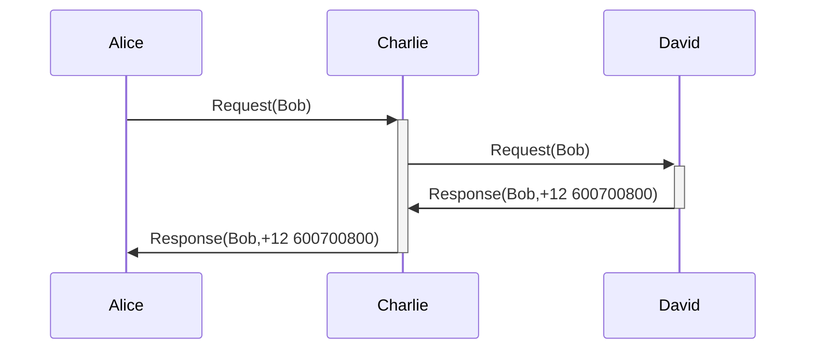
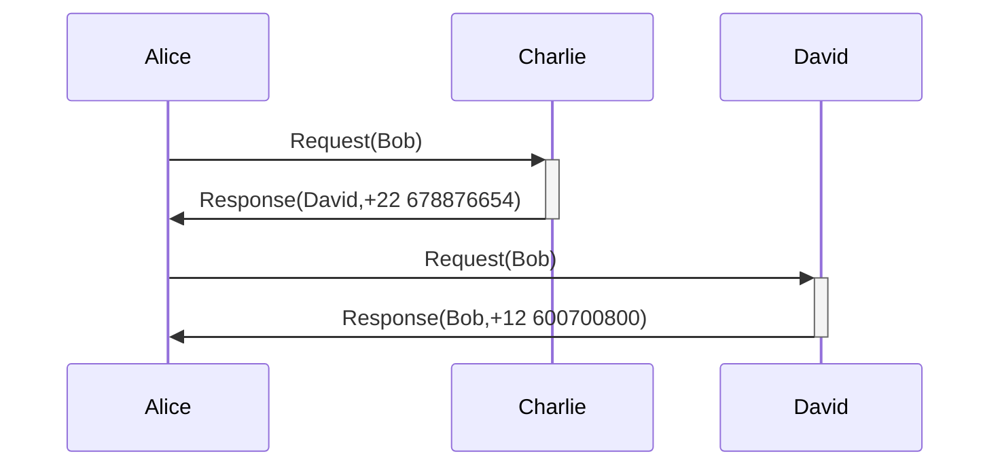

#flashcards/dns 
#review2 

- DNS nos puede recordar a un sistema de agenda telefónica, en donde normalmente un usuario, llamémosle Alice, no recuerda el número de teléfono de la persona a la que quiere llamar pero sí su nombre, por ejemplo, Bob. Por lo tanto, Alice buscará en su agenda el número de teléfono de Bob, que es lo que realmente necesita su móvil/fijo para poder realizar la llamada.
- Podemos preguntarnos, ¿qué pasa si Alice no tiene en su agenda a Bob? Alice podría llamar a Charlie, a quien sí tiene en su agenda, y preguntarle si tiene el número de teléfono de Bob. Aquí podrían pasar dos cosas:
	- Charlie sí tiene el teléfono de Bob, por lo que se lo da a Alice.
	- Charlie no tiene el teléfono de Bob, pero sí tiene el teléfono de David que podría saber esa información. En este caso se podrían dar dos situaciones:
		- Charlie le pasa el nombre y teléfono de David a Alice para que lo llame ella (esto se conoce en DNS como servicio iterativo -ver [[Tipos de Consultas DNS]]-)
		- Charlie llama a David y le pregunta si sabe el número de teléfono de Bob. En este momento, se pueden dar las mismas circunstancias que cuando Alice llama a Charlie (este caso se conoce en DNS como servicio recursivo -ver [[Tipos de Consultas DNS]]-)
- Ejemplo donde Charlie presta un servicio recursivo [^1]

- Ejemplo donde Charlie presta un servicio iterativo [^1]

[^1]: es importante resaltar que Bob no interviene en estos intercambios de mensajes.