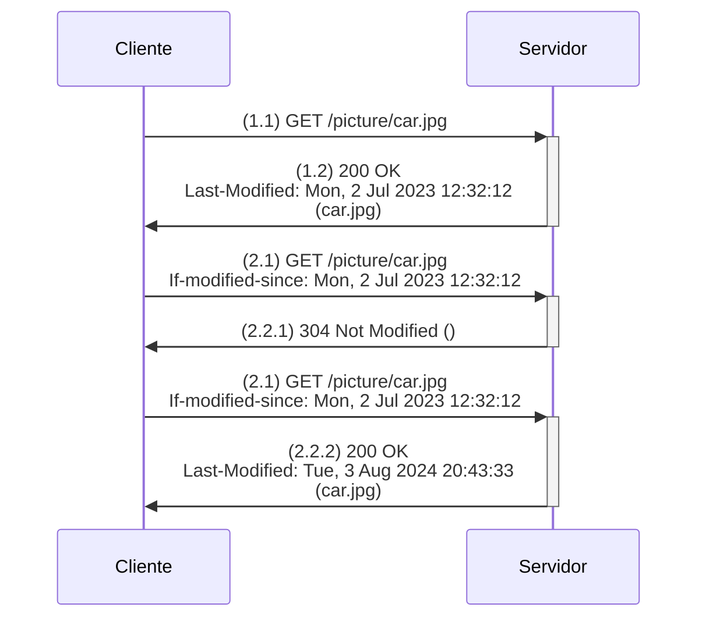

#flashcards/http 
#review2

## 1.  Ejemplo cuando el cliente **no** tiene el [[Recurso web]] en su memoria caché
### 1.1 Mensaje de solicitud (**GET normal**)
> GET /picture/car.jpg HTTP/1.0
> User-agent: Mozilla/4.0

### 1.2 Mensaje de respuesta a la solicitud anterior
> HTTP/1.0 200 OK 
> Date: Wed, 4 Aug 2023 16:21:22
> Server: Apache/1.3.0 (Unix)
> Last-Modified: Mon, 2 Jul 2023 12:32:12
> Content-Type: image/jpg
> 
> (.......contenido del objeto.......)

## 2. Ejemplo cuando el cliente **sí** tiene el [[Recurso web]] en su memoria caché
### 2.1 Mensaje de solicitud (GET condicional)
> GET /picture/car.jpg HTTP/1.0
> User-agent: Mozilla/4.0
> If-modified-since: Mon, 2 Jul 2023 12:32:12
### 2.2 Existen dos posibilidades: que el objeto no haya sido modificado y que sí lo haya sido.
#### 2.2.1 Respuesta del servidor cuando el objeto **no** ha sido modificado
> HTTP/1.0 304 Not Modified
> Date: Wed, 4 Aug 2023 18:35:11
> Server: Apache/1.3.0 (Unix)
>   
> (....... cuerpo vacío, sin contenido ........)
#### 2.2.2 Respuesta del servidor cuando el objeto **sí** ha sido modificado
> HTTP/1.0 200 OK 
> Date: Wed, 4 Aug 2023 18:35:11
> Server: Apache/1.3.0 (Unix)
> Last-Modified: Wed, 4 Aug 2023 17:59:43
>
> (....... contenido del objeto .......)

