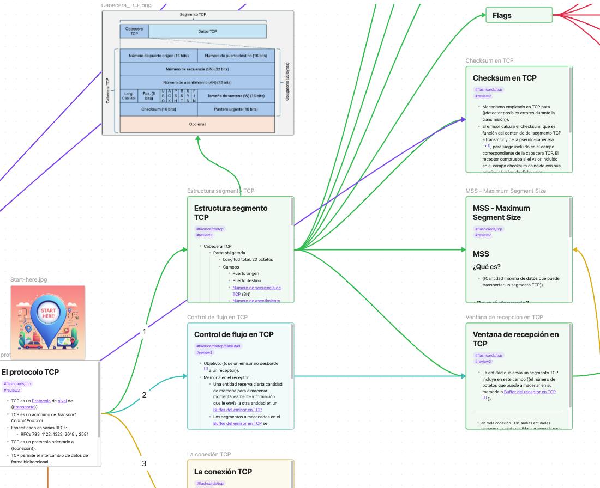

# Mapa Mental Aumentado para Arquitectura de Redes

Vault de Obsidian con notas para seguir la asignatura Arquitectura de Redes I y Arquitectura de Redes de la Universidad de Alcalá. En el siguiente vídeo puedes ver cómo instalar y utilizar este Mapa Mental Aumentado https://youtu.be/P0n3VQC195w?si=qdwPfx607jwX_zTv

## Instalación
- Descarga e instala Obsidian [https://obsidian.md/], que es un gestor de notas libre para uso personal y sin ánimo de lucro.
- Descarga el contenido del Mapa Mental Aumentado para Arquitectura de Redes I (llamado *vault* en obsidian) desde [https://github.com/JaimeGarciaReinoso/MapaMentalAumentadoAR]. Puedes pinchar en el botón verde que pone *<> Code* y seleccionar la opción de *Download ZIP*. También te lo puedes descargar usando el comando *git clone https://github.com/JaimeGarciaReinoso/MapaMentalAumentadoAR.git*
- Una vez descomprimido el fichero zip, o descargado usando el comando *git*, puedes abrir Obsidian e importar el *vault* seleccionando Fichero -> Abrir vault . Luego selecciona *Abrir directorio como vault* y selecciona el directorio que acabas de descomprimir. Finalmente debes confiar en este *vault*, ya que se cargarán algunos plugins de los que hablaremos más adelante.
- Puedes cambiar el idioma (Settings->General) y la apariencia/tema (Settings->Appearance).

## Estudiar con el Mapa Mental Aumentado
- En Obsidian verás que hay varios directorios. Aunque puedes utilizar las notas que están en el directorio *01-Notas*, se recomienda utilizar los *canvas* que puedes encontrar en el directorio *02-Canvas*.
- Dentro del directorio *02-Canvas* puedes encontrar el canvas *Principal*, que contiene elementos que enlazan al resto de canvas.
- Busca siempre el icono que dice *Start here* para saber en qué punto debes comenzar a leer en el canvas. 
- Las flechas que unen los elementos de los canvas indican el orden sugerido para continuar la lectura.
- Para hacer zoom en una tarjeta específica selecciónala y pulsa las teclas "Shift+2". Para ver todas las tarjetas puedes pulsar las teclas "Shift+1".
- Algunas notas contienen cadenas de texto encerradas entre dobles llaves \{\{\}\}. Esto indica que dicho contenido es muy importante, por lo que hay que estudiarlo detenidamente. Esta identificación de dobles llaves la utiliza el plugin de *Spaced Repetition* para el repaso de tarjetas [[README#Repaso de las tarjetas]].

## Repaso de las tarjetas
- El *vault* incluye el plugin *Spaced Repetition* que permite repasar las notas estudiadas. A la izquierda de Obsidian verás un icono que parecen unas barajas (si no lo encuentras, presiona CMD+P o CTRL+P y busca Spaced Repetition). Si lo seleccionas, verás que se abre una ventana con una estructura jerárquica. Selecciona el mazo de preguntas que quieras estudiar/repasar.
- Una vez seleccionado el mazo, te presentará notas de forma aleatoria en donde una parte de la misma estará oculta para que trates de recordar cuál es la respuesta correcta.
- Cuando quieras avanzar presiona el botón de *Show Answer*. Te aparecerán tres botones para seleccionar si consideras que la pregunta era *Easy*, *Good* o *Hard*. Contesta con sinceridad, porque esto es importante para que el algoritmo se adapte a tus conocimientos para preguntarte lo que más te cueste recordar.
- Hay muchas opciones: repasar sólo las tarjeta difíciles, repasar todas, etc. Puedes ver más información en el github del repositorio: https://github.com/st3v3nmw/obsidian-spaced-repetition

## Modificación y contribución
- El material se publica para que sirva de base para estudiar la asignatura Arquitectura de Redes I, pero puedes ampliarlo, corregirlo y modificarlo para que se adapte a tu forma de estudiar. Puedes echarle un ojo a la [[LICENSE|licencia]] por si quieres distribuirlo o crear un material ampliado del mismo.
- Si quieres contribuir, o reportar un problema, puedes hacerlo en el github del mapa mental ampliado de AR1 https://github.com/JaimeGarciaReinoso/MapaMentalAumentadoAR

## Ayúdanos a difundir este trabajo
- Este proyecto se presentó a la convocatoria de Proyectos de Innovación Docente 2024 de la Universidad de Alcalá, resultando *no aprobado* ya que la comisión evaluadora consideró que "A juicio de la comisión, estas actividades no se consideran que sean de innovación docente". Aún así, el proyecto se ha realizado sin el apoyo de la UAH porque creemos que este mapa mental aumentado sí es un proyecto de innovación. Si tú tampoco estás de acuerdo con la comisión, te agradecería que les envíes un correo a [ideo@uah.es](mailto:ideo@uah.es) con un texto similar al siguiente:
	- Asunto del correo: Apoyo al proyecto de innovación docente UAH/EV1535
	- Contenido del correo: Después de ver el contenido del proyecto "Un Mapa Mental Aumentado para la asignatura Arquitectura de Redes I" con código UAH/EV1535, disponible en https://github.com/JaimeGarciaReinoso/MapaMentalAumentadoAR, y no aprobado en la convocatoria de Proyectos de Innovación Docente 2024 de la Universidad de Alcalá, considero que la comisión se equivocó en su juicio ya que, en mi opinión, este es un proyecto que representa una innovación con respecto al material disponible en la asignatura.
- Y por supuesto, ¡¡¡comparte este proyecto con tus amigos/colegas/conocidos a los que les pueda resultar útil!!!